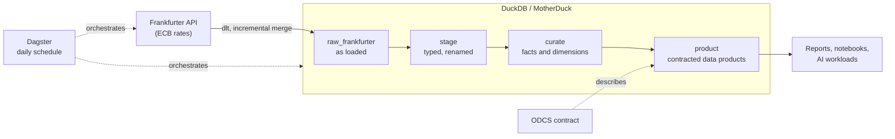

# Data Platform Starter

A runnable baseline data platform: ingestion with [dlt](https://dlthub.com), a [DuckDB](https://duckdb.org) warehouse (or [MotherDuck](https://motherduck.com)), modelling with [dbt](https://www.getdbt.com) and orchestration with [Dagster](https://dagster.io). It comes with data contracts, quality gates and CI.

It's small enough to read in an afternoon and complete enough to clone as the start of a real platform. The example data product publishes daily ECB exchange rates per GBP.

```sh
uv sync
uv run invoke demo
```

```
Done. PASS=31 WARN=0 ERROR=0 SKIP=0 NO-OP=0 REUSED=0 TOTAL=31
fx_rates_gbp: 660 rows, latest 2026-09-30. 1 GBP = EUR 1.1701, JPY 208.5932, USD 1.3286
```

The demo runs offline from recorded API responses, so it needs no keys or network access.

---

## Architecture



| Layer | Schema | What lives there | Materialised as |
|---|---|---|---|
| Raw | `raw_frankfurter` | Source data exactly as dlt loaded it | Tables (dlt) |
| Stage | `stage` | One model per source table: types cast, columns renamed | Views |
| Curate | `curate` | Business entities: `fct_exchange_rates`, `dim_currencies` | Tables |
| Product | `product` | Contracted, consumer-facing outputs: `fx_rates_gbp` | Tables, contract enforced |

Dagster sees dlt resources and dbt models as one asset graph, so lineage runs from the API to the product:

```
frankfurter/exchange_rates → stage/stg_frankfurter__exchange_rates → curate/fct_exchange_rates ┐
frankfurter/currencies     → stage/stg_frankfurter__currencies     → curate/dim_currencies      ┴→ product/fx_rates_gbp
```

## Quality gates

Tests carry a severity. **Errors block** the build, because the data is wrong. **Warnings alert** someone, because the data might be wrong.

| Check | Where | Severity | Why |
|---|---|---|---|
| Not empty | Every source and model | error | "No failing rows" on an empty table proves nothing |
| Unique keys, not null | Stage, curate, product | error | Duplicates and gaps corrupt joins and totals |
| Rates are positive | Stage, curate, product | error | A zero or negative rate is never valid |
| Referential integrity | `fct_exchange_rates` → `dim_currencies` | error | Every rate has a known currency |
| GBP is exactly 1 per GBP | `fx_rates_gbp` | error | Catches broken cross-rate maths |
| Enforced model contract | `fx_rates_gbp` | error | Column names and types can't drift silently |
| Daily currency coverage | `fx_rates_gbp` | warn | A partial load looks like a day with fewer currencies |
| Source freshness | `raw_frankfurter.exchange_rates` | warn after 4 days, error after 7 | Allows for weekends and ECB holidays |

## Data contracts

`fx_rates_gbp` is published under an [Open Data Contract Standard](https://bitol-io.github.io/open-data-contract-standard/) contract in [`contracts/fx_rates_gbp.odcs.yaml`](contracts/fx_rates_gbp.odcs.yaml). It covers the schema, the quality rules, the SLAs and the owner.

The same columns are enforced by dbt's model contract, so a build fails if the SQL produces anything else. `tests/test_contract.py` checks that the ODCS contract and the dbt contract describe the same table. That means the published promise and the enforced one can't drift apart.

## Working with it

| Task | What it does |
|---|---|
| `uv run invoke demo` | Ingest fixtures, build and test every model, print a summary |
| `uv run invoke ingest` | Load the last 30 days from the live API (`--fixtures` for offline data, `--start-date` to backfill) |
| `uv run invoke build` | Build and test all dbt models |
| `uv run invoke freshness` | Check source freshness against live data |
| `uv run invoke dagster` | Dagster UI on :3000 with the full asset graph (`--fixtures` to run offline) |
| `uv run invoke lint` | ruff, mypy (strict), sqlfluff and version pins |
| `uv run invoke test` | Unit, contract and end-to-end tests with coverage |
| `uv run invoke audit` | Dependency vulnerability scan |
| `uv run invoke smoke` | Build the Docker image and run the demo inside it |

Configuration is all environment variables:

| Variable | Default | Purpose |
|---|---|---|
| `WAREHOUSE_PATH` | `data/warehouse.duckdb` | Local DuckDB file |
| `DESTINATION` / `DBT_TARGET` | `duckdb` / `local` | Set to `motherduck` for both to use MotherDuck |
| `MOTHERDUCK_DATABASE` | `data_platform_starter` | MotherDuck database for dbt |
| `DBT_SCHEMA_PREFIX` | none | Isolate a build, e.g. `pr_12` writes to `pr_12_product` |
| `USE_FIXTURES` | none | Make Dagster and `ingest` read recorded data |

### Branch-isolated builds

Set `DBT_SCHEMA_PREFIX` to your branch or pull request, and every layer is built into its own schemas (`pr_12_stage`, `pr_12_curate`, `pr_12_product`). You can test changes against real data without touching anyone else's tables. Unset, models land in the plain layer schemas, the same in every environment. See [`dbt/macros/generate_schema_name.sql`](dbt/macros/generate_schema_name.sql).

## CI

Every pull request runs lint (including SQL), the full test suite and a dependency audit. It also runs a secrets scan and a Docker smoke test that builds every model inside the image. The end-to-end tests run dlt and dbt against the recorded fixtures, so CI is fast, deterministic and needs no credentials.

## Making it yours

- **Swap the source.** Replace `sources.py` with your own dlt source, record a few responses into `fixtures/`, and rename the staging models.
- **Swap the warehouse.** See [docs/swapping-the-warehouse.md](docs/swapping-the-warehouse.md) for Snowflake, BigQuery and Databricks.
- **Add a product.** Add a model under `dbt/models/products/` with a contract, plus an ODCS contract in `contracts/`, and extend `tests/test_contract.py`.

Decisions and their reasoning are recorded in [`docs/adr/`](docs/adr/).

## Project layout

```
src/data_platform_starter/
    sources.py        dlt source: Frankfurter API, incremental
    pipeline.py       dlt pipeline and destination selection
    transform.py      dbt runner and schema naming
    definitions.py    Dagster assets, resources and schedule
    fixtures/         recorded API responses for offline runs
dbt/
    models/           staging/, curated/, products/
    tests/            generic and singular data tests
    macros/           branch-aware schema naming
contracts/            ODCS data contracts
tests/                unit, contract and end-to-end tests
docs/                 ADRs and guides
```

---

Generated from [Qualixto/python-template](https://github.com/Qualixto/python-template), and kept up to date with `uvx copier update --trust`. Maintained by [Qualixto](https://qualixto.com), licensed [Apache-2.0](LICENSE).
